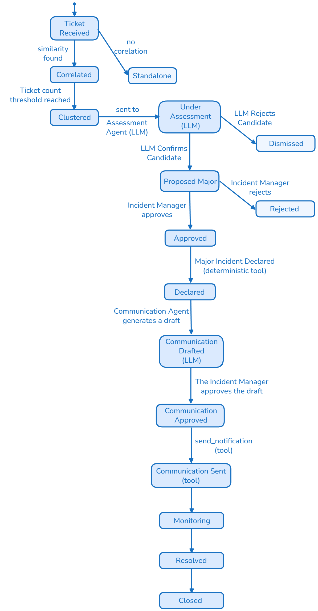
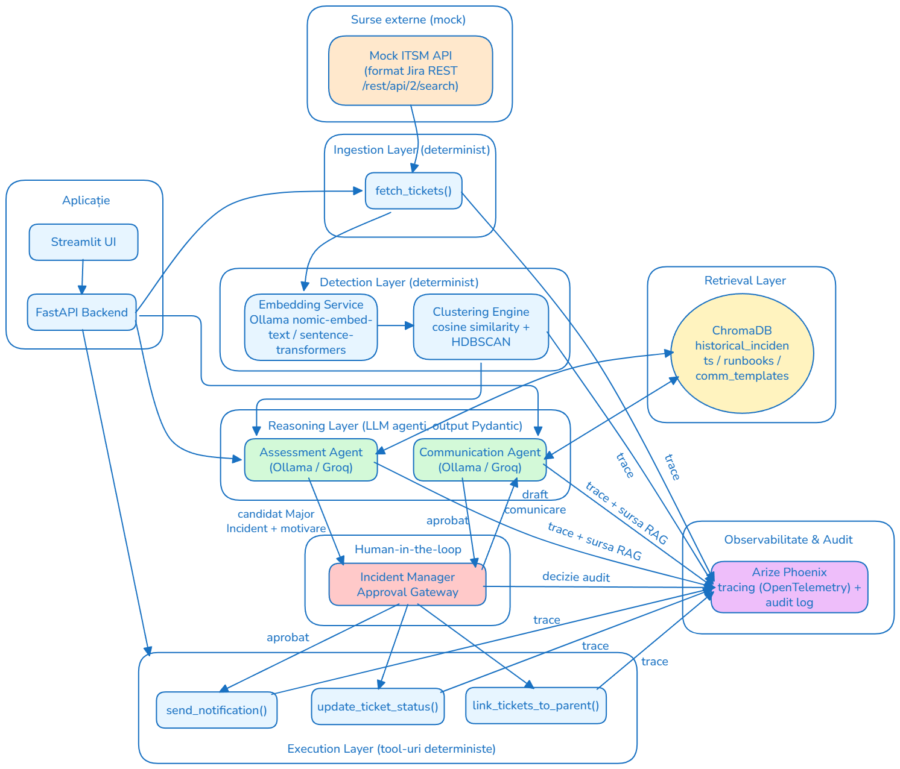
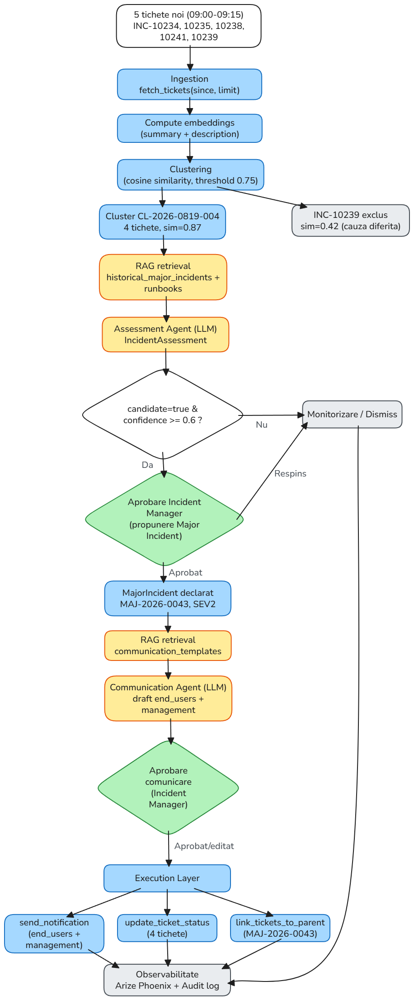
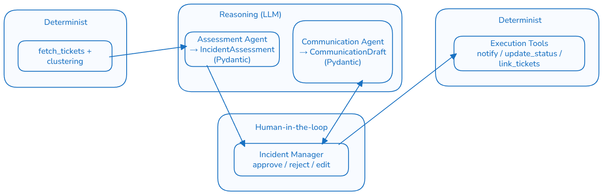
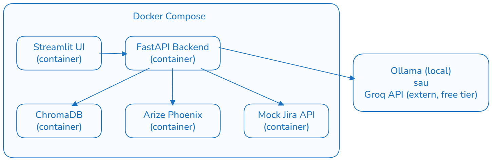

# Documentație Proiect
## Agent AI pentru Detecția Incidentelor Majore și Generarea Comunicării Automate
### Categorie: IT Service Management (ITSM) – Incident Management

**Denumire agent:** Major Incident Agent (MIA)
**Autor:** _[]_

---

## Cuprins

1. [Definirea problemei și scopul proiectului](#1-definirea-problemei-și-scopul-proiectului)
2. [Înțelegerea procesului (AS-IS)](#2-înțelegerea-procesului-as-is)
3. [Soluția propusă / Fluxul TO-BE](#3-soluția-propusă--fluxul-to-be)
4. [Arhitectura generală a sistemului](#4-arhitectura-generală-a-sistemului)
5. [Structura datelor și abordarea RAG](#5-structura-datelor-și-abordarea-rag)
6. [Reasoning / Decizie / Execuție](#6-reasoning--decizie--execuție)
7. [KPI-uri și Success Criteria](#7-kpi-uri-și-success-criteria)
8. [Observabilitate și audit](#8-observabilitate-și-audit)
9. [Stack tehnic și livrarea ca produs](#9-stack-tehnic-și-livrarea-ca-produs)
10. [Riscuri, limitări și dezvoltări viitoare](#10-riscuri-limitări-și-dezvoltări-viitoare)
11. [Anexe](#11-anexe)

---

## 1. Definirea problemei și scopul proiectului
### 1.1 Context business / IT

În organizațiile mari, un incident major — precum indisponibilitatea unei aplicații critice, o defecțiune a rețelei sau o cădere a serviciilor cloud — generează frecvent un val de tichete individuale, raportate într-un interval scurt de timp de utilizatori diferiți, dar având aceeași cauză reală.

Într-un proces ITSM tradițional, fiecare incident este înregistrat și analizat separat de către echipa de suport. Atunci când mai mulți utilizatori raportează aceeași problemă, tichetele similare pot fi tratate inițial ca incidente distincte. Identificarea faptului că acestea au o cauză comună și reprezintă, de fapt, **un singur incident major**, se bazează în mare parte pe analiza manuală și pe experiența operatorilor sau a Incident Managerului.

Corelarea incidentelor presupune compararea unor informații precum titlul și descrierea, serviciul sau aplicația afectată, utilizatorii, locația și momentul raportării. Atunci când numărul de tichete este mare, analiza manuală devine dificilă și poate întârzia identificarea unui incident major. 

După identificarea unui posibil incident major, comunicarea către utilizatorii afectați și management este adesea realizată manual. Acest lucru poate duce la întârzieri și la mesaje diferite ca exprimare, structură și detaliile date, în funcție de destinatari.

Această abordare poate conduce la:
- **identificarea întârziată a incidentelor majore, din cauza lipsei corelării automate între tichetele similare**;
- **creșterea efortului manual, necesar pentru analizarea unui număr mare de tichete**;
- **prioritizare și escaladare inconsistente, în funcție de experiența și disponibilitatea operatorilor**;
- **creșterea numărului de tichete duplicate, deoarece utilizatorii pot raporta aceeași problemă fără să știe că aceasta este deja investigată**;
- **întârzierea comunicării către utilizatori și management, precum și transmiterea unor mesaje diferite ca structură și conținut**;
- **creșterea MTTR (Mean Time to Repair), ca urmare a timpului suplimentar necesar pentru identificarea și gestionarea incidentului**;
- **scăderea încrederii utilizatorilor și a business-ului în serviciile IT, ca urmare a lipsei de vizibilitate și a comunicării întârziate**.

Prin urmare, problema nu este doar volumul mare de tichete, ci și dificultatea de a identifica rapid faptul că mai multe incidente aparent independente au aceeași cauză și fac parte dintr-un singur incident major.

### 1.2 Obiectivul proiectului

Obiectivul proiectului este dezvoltarea unui agent AI (**Major Incident Agent**) care:
1. **Detectează automat** posibile incidente majore prin analiza similarității semantice (embeddings + cosine similarity + clustering) între tichetele nou create într-un interval de timp definit.
2. **Evaluează** (prin LLM, cu output structurat/validat) dacă un cluster de tichete similare reprezintă cu adevărat un candidat de incident major, pe baza informațiilor istorice relevante (RAG).
3. **Generează automat** un draft de comunicare (separat pentru utilizatorii finali și pentru management), pe baza unor template-uri și a informațiilor relevante despre incident.
4. Trece comunicarea și declararea incidentului major printr-un **punct de aprobare umană** (human-in-the-loop) înainte de trimiterea rezultatului.
5. **Loghează și expune** întregul lanț de decizie (audit + observabilitate).

### 1.3 Scopul proiectului (In-Scope)

- Introducerea de tichete (mock data, format text – „problem report”) simulând un flux realist dintr-un ITSM (ex. ServiceNow/Jira-like).
- Calcul embeddings pe descrierea tichetelor + clustering pe similaritate cosinus, într-o fereastră de timp configurabilă (ex. ultimele 15-30 min / ultimele N tichete).
- Un modul LLM de **assessment** (confirmă / infirmă candidatul de incident major, motivează, estimează gravitatea) – output JSON validat Pydantic.
- Un modul RAG (ChromaDB) cu bază de cunoștințe: incidente majore istorice + post-mortem-uri + runbook-uri + template-uri de comunicare, folosit pentru a fundamenta atât decizia, cât și textul comunicării (cu citări).
- Generare comunicare (2 variante: user-facing, management-facing), output JSON validat.
- Guardrail de aprobare umană înainte de orice acțiune „vizibilă extern" (trimitere comunicare, declarare oficială major incident).
- Execuție deterministă a acțiunilor aprobate (tool-uri: trimitere notificare, update status tichete, link-uire tichete la incidentul părinte).
- Observabilitate end-to-end (Arize Phoenix) și audit trail.
- KPI de măsurare a impactului față de procesul manual.
- Livrare: API FastAPI + UI Streamlit + containerizare Docker.

### 1.4 În afara scopului (Out of Scope)

- Remedierea tehnică efectivă a incidentului (root cause fixing) – agentul **nu** execută acțiuni de remediere infrastructură (restart servicii, rollback deploy etc.), doar detectează, evaluează și comunică.
- Integrare live cu un ITSM real de producție (ServiceNow/Jira) – se lucrează cu date mock și, opțional, conectori simulați.
- Traducere în mai multe limbi a comunicărilor (se livrează în limba definită în configurare, implicit EN).
- Predicție proactivă de incidente înainte ca tichetele să apară (capacity/anomaly forecasting) – agentul e reactiv, bazat pe tichetele deja create.
- Fine-tuning propriu al unui model LLM (se folosește few-shot / prompt engineering pe model open-source via Ollama sau Groq free tier).

### 1.5 Asumpții (Assumptions)

- Tichetele conțin minim: id, timestamp, textul problemei (free text), serviciul/aplicația afectată (dacă e cunoscută), prioritate inițială, reporter.
- Volumul și distribuția temporală a tichetelor mock reflectă tipare realiste (perioade „calme" + „burst"-uri simulând incidente majore).
- Un incident „major" este definit organizațional printr-un set de criterii cuantificabile, nu doar prin percepția LLM-ului.
- Accesul la modelele LLM/embeddings (Ollama local sau Groq API free tier) este disponibil în mediul de dezvoltare/demo.

## 2. Înțelegerea procesului (AS-IS)
### 2.1 Procesul tradițional de Incident Management

Într-un proces ITSM tradițional, incidentele sunt raportate și gestionate inițial ca tichete individuale. Un utilizator poate raporta o problemă prin intermediul unui portal self-service, email, telefon sau al altui canal disponibil, iar sistemul ITSM creează un tichet asociat problemei raportate.

Procesul tradițional poate fi reprezentat astfel:

```text
Incident raportat
       ↓
Creare tichet
       ↓
Clasificare și prioritizare
       ↓
Alocare către echipa responsabilă
       ↓
Analiză și investigare manuală
       ↓
Căutare manuală a incidentelor similare
       ↓
Identificare posibil Major Incident
       ↓
Escaladare / Confirmare
       ↓
Declarare Major Incident
       ↓
Comunicare către utilizatori și management
       ↓
Rezolvare Ticket
       ↓
Închidere Ticket
```

Procesul este în principal bazat pe analiza individuală a tichetelor și pe intervenția persoanelor responsabile de Incident Management. Corelarea mai multor incidente care pot avea aceeași cauză este realizată în funcție de informațiile disponibile și de observațiile echipelor implicate.

### 2.2 Raportarea și înregistrarea incidentelor

Fiecare problemă raportată de un utilizator este înregistrată, de regulă, ca un tichet individual în sistemul ITSM.

În cazul în care mai mulți utilizatori întâmpină aceeași problemă, pot fi create mai multe tichete distincte. De exemplu, pentru o problemă asociată serviciului VPN pot apărea următoarele incidente:
- INC001 — „Cannot access corporate VPN”
- INC002 — „VPN connection failing”
- INC003 — „Remote employees cannot connect to VPN”
- INC004 — „VPN authentication unavailable”
- INC005 — „Unable to establish VPN connection”

Deși aceste tichete pot descrie aceeași problemă din perspective diferite, ele sunt inițial înregistrate și procesate separat.

### 2.3 Clasificarea, prioritizarea și alocarea

După înregistrare, fiecare tichet este analizat și clasificat conform procesului ITSM existent.
În această etapă sunt stabilite, în funcție de informațiile disponibile:
- categoria incidentului;
- serviciul afectat;
- impactul;
- urgența și prioritatea;
- echipa responsabilă de investigare și rezolvare.

Tichetele sunt apoi alocate către grupurile de suport sau echipele tehnice corespunzătoare.
Analiza este realizată în principal la nivelul fiecărui tichet. În consecință, faptul că mai multe incidente pot avea aceeași cauză nu este întotdeauna evident în această etapă.

### 2.4 Investigarea și identificarea incidentelor similare

Echipa responsabilă investighează fiecare incident și încearcă să determine cauza problemei.
Atunci când există suspiciunea că mai multe incidente sunt corelate, operatorii pot căuta manual alte tichete cu simptome similare. Această analiză poate lua în considerare informații precum:
- descrierea incidentului;
- serviciul afectat;
- momentul apariției;
- simptomele raportate;
- numărul de utilizatori afectați;
- informațiile disponibile în sistemul ITSM.

Identificarea unei relații între incidente depinde de informațiile disponibile și de experiența persoanelor care efectuează analiza.
În cazul unor formulări diferite ale aceleiași probleme, corelarea poate necesita o analiză suplimentară.

### 2.5 Identificarea și confirmarea unui posibil Incident Major

Un posibil Incident Major poate fi identificat atunci când operatorii observă un volum neobișnuit de incidente similare, un impact semnificativ asupra unui serviciu sau alte indicii care sugerează existența unei probleme comune.

Identificarea poate apărea, de exemplu:
- în urma analizei dashboard-urilor ITSM;
- după mai multe escaladări;
- prin comunicarea dintre echipe;
- ca urmare a creșterii numărului de incidente pentru același serviciu;
- în urma identificării unor simptome comune în mai multe tichete.

După identificarea unui posibil Major Incident, situația este analizată împreună cu echipele tehnice relevante pentru confirmarea impactului și a existenței unei posibile cauze comune.
În funcție de criteriile organizației, Incident Manager-ul sau persoana responsabilă decide dacă incidentul trebuie declarat Major Incident.

### 2.6 Comunicarea

Pe durata unui Major Incident, informațiile despre incident sunt comunicate către părțile interesate relevante.
Comunicarea poate include:
- serviciul afectat;
- problema identificată sau suspectată;
- impactul asupra utilizatorilor;
- statusul curent;
- acțiunile aflate în desfășurare;
- următorul update estimat, atunci când acesta este disponibil.

Mesajele pot fi adaptate în funcție de audiență. Utilizatorii finali necesită, de regulă, informații orientate către impact și disponibilitatea serviciului, în timp ce managementul necesită informații suplimentare privind amploarea incidentului, impactul și acțiunile de remediere.
În procesul actual, pregătirea și transmiterea comunicărilor presupun intervenție manuală.

### 2.7 Rezolvarea și închiderea

După identificarea și implementarea soluției, serviciul este readus în starea normală de funcționare.
Incidentele asociate sunt actualizate conform procedurilor ITSM, iar după îndeplinirea criteriilor de închidere acestea sunt închise.
Informațiile rezultate în urma incidentului pot fi ulterior utilizate pentru documentație, analiză post-incident și îmbunătățirea procesului.

### 2.8 Principalele blocaje și limitări ale procesului

Analiza procesului actual evidențiază mai multe puncte în care activitățile manuale pot produce întârzieri sau inconsistențe.

| # | Blocaj / limitare | Impact asupra procesului |
|---|---|---|
| 1 | Identificarea unui volum neobișnuit de incidente depinde de observația operatorilor | Un posibil Major Incident poate fi identificat cu întârziere |
| 2 | Tichetele sunt analizate inițial individual | Incidentele care au aceeași cauză pot rămâne fragmentate |
| 3 | Incidentele similare pot utiliza formulări diferite | Corelarea lor necesită analiză manuală |
| 4 | Confirmarea unui posibil Major Incident necesită coordonare între echipe | Poate crește timpul până la escaladare și declarare |
| 5 | Asocierea incidentelor cu un incident-părinte poate fi manuală | Crește efortul operațional și riscul de inconsistențe |
| 6 | Comunicările sunt pregătite și adaptate manual | Pot apărea întârzieri sau diferențe între comunicări |
| 7 | Informațiile istorice sunt accesate manual | Contextul relevant poate să nu fie identificat la momentul potrivit |
| 8 | Deciziile și acțiunile pot fi distribuite între mai multe sisteme și persoane | Trasabilitatea procesului poate fi dificil de reconstruit |

### 2.9 Ce poate fi îmbunătățit cu ajutorul AI

Din analiza AS-IS reies câteva puncte concrete unde un agent AI poate elimina munca manuală, fără să înlocuiască decizia umană pe zonele riscante:

| Etapă manuală (AS-IS) | Ce automatizează AI | Ce rămâne manual |
|---|---|---|
| Căutare manuală a tichetelor similare | Embeddings + clustering pe cosine similarity, rulat continuu | — |
| Interpretarea dacă un cluster e „suficient de mare/grav" | LLM Assessment Agent, fundamentat pe RAG (incidente istorice similare) | Confirmarea finală a candidatului |
| Scriere comunicare (user vs management) | LLM Communication Agent, pe bază de template-uri din RAG | Aprobarea și eventuala editare a textului |
| Declarare oficială Major Incident | Propunere structurată, cu motivare și severitate estimată | Decizia de declarare (aprobare/respingere) |
| Legarea tichetelor la incidentul părinte | Tool determinist, executat automat după aprobare | — |

## 3. Soluția propusă / Fluxul TO-BE

### 3.1 Descrierea soluției

Soluția propusă urmărește automatizarea etapelor de identificare și evaluare a incidentelor care pot indica existența unui Incident Major, păstrând controlul uman asupra deciziilor cu impact operațional.

În locul identificării exclusiv manuale a relațiilor dintre tichete, sistemul analizează continuu incidentele noi și identifică grupuri de incidente care prezintă caracteristici comune.

Fluxul TO-BE este:
```text
Tichet nou
    ↓
Analiză și corelare cu incidente recente
    ↓
Identificarea unui grup de incidente similare
    ↓
Evaluare posibil Incident Major
    ↓
Propunere Incident Major
    ↓
Validare și aprobare Incident Manager
    ↓
Declarare Incident Major
    ↓
Pregătire comunicare
    ↓
Aprobare comunicare
    ↓
Transmitere comunicare
    ↓
Monitorizare evoluție incident
    ↓
Rezolvare și comunicare de închidere
```

### 3.2 Fluxul TO-BE

La apariția unui tichet nou, sistemul verifică dacă acesta este asociat unor incidente recente cu caracteristici similare.

Dacă nu este identificată o corelare relevantă, tichetul continuă pe fluxul standard de Incident Management.

Dacă sunt identificate suficiente incidente similare, acestea sunt grupate într-un posibil cluster de incidente corelate. Clusterul este evaluat pentru a determina dacă există indicii suficiente pentru inițierea procesului de Incident Major.

În cazul identificării unui posibil Incident Major, Incident Manager-ul primește o propunere care include informațiile relevante pentru luarea deciziei.

Dacă propunerea este aprobată, incidentul este declarat Incident Major și sunt inițiate activitățile corespunzătoare, inclusiv comunicarea către utilizatori și management.

Pe durata incidentului, sistemul continuă să urmărească evoluția situației și poate propune actualizări ale statusului sau comunicări suplimentare.

După rezolvarea incidentului, poate fi propusă comunicarea de închidere, care este supusă aceluiași proces de validare înainte de transmitere.

### 3.3 Ce diferă concret față de AS-IS

| Dimensiune | AS-IS (manual) | TO-BE (agentic) |
|---|---|---|
| Corelare tichete | Manuală, de la caz la caz | Continuă, automată (embeddings + clustering) |
| Timp până la identificare candidat | Minute–ore, în funcție de observația operatorului | Secunde–minute, pe fereastră configurabilă |
| Fundamentare decizie | Experiență individuală | RAG pe istoric (incidente similare, runbook-uri), cu citări |
| Consistență comunicare | Variabilă, per persoană | Template + LLM, consistentă pe structură |
| Decizie finală | 100% umană | Umană, dar asistată de propunere structurată (human-in-the-loop) |
| Trasabilitate | Fragmentată, în mai multe sisteme | Centralizată (audit trail + observabilitate) |

## 4. Arhitectura generală a sistemului
### 4.1 Principii de arhitectură

Arhitectura pentru Major Incident Agent este construită pe câteva principii care se aplică la nivelul întregului sistem:

1. **Separare reasoning / execuție** – componentele care „gândesc" (LLM) nu ating niciodată direct un sistem extern; ele produc doar propuneri structurate (JSON validat Pydantic). Componentele care „acționează" sunt tool-uri deterministe, apelate doar după validare/aprobare.
2. **Human-in-the-loop pe punctele riscante** – orice acțiune vizibilă extern (comunicare trimisă, incident declarat oficial) trece printr-un gate de aprobare umană.
3. **Trasabilitate completă** – fiecare pas (input, prompt, output LLM, sursă RAG, decizie umană, acțiune executată) este logat și expus prin observabilitate.
4. **Componente înlocuibile** – detectarea (embeddings/clustering), reasoning-ul (LLM) și execuția (tool-uri) sunt module separate, ce pot fi înlocuite/actualizate independent (ex. schimbarea providerului LLM din Ollama în Groq nu afectează restul sistemului).

### 4.2 Roluri de agenți

| Agent / Componentă | Tip | Responsabilitate | Output |
|---|---|---|---|
| **Ticket Ingestion Service** | Determinist (tool) | Preia tichetele din sursa mock (Jira-like API) | Listă tichete (JSON) |
| **Detection Pipeline** | Determinist (embeddings + clustering) | Calculează embeddings pe descrierea tichetelor, aplică clustering pe cosine similarity într-o fereastră de timp | Clustere candidate de tichete similare |
| **Assessment Agent (LLM)** | Reasoning | Analizează un cluster candidat + context RAG, decide dacă e plauzibil un Major Incident, estimează severitate, motivează | `IncidentAssessment` (Pydantic) |
| **Communication Agent (LLM)** | Reasoning | Generează draft de comunicare (user-facing + management-facing), pe baza template-urilor și a contextului RAG | `CommunicationDraft` (Pydantic) |
| **Approval Gateway** | Human-in-the-loop | Incident Manager validează/respinge propunerea de Major Incident și draftul de comunicare | Decizie (approve/reject/edit) |
| **Execution Layer** | Determinist (tool-uri) | Execută acțiunile aprobate: trimite notificare, actualizează status tichete, leagă tichete la incidentul părinte | Confirmare execuție |
| **Observability Layer** | Infrastructură | Trace-uiește fiecare pas al fluxului (Arize Phoenix) și menține audit trail | Trace-uri + audit log |
| **Orchestrator** | Coordonator | Coordonează handoff-urile între componente, menține state-ul fluxului | State transitions |

### 4.3 Tool-uri (function-calling / deterministice)

| Tool | Rol | Apelat de |
|---|---|---|
| `fetch_tickets(since, limit)` | Interoghează mock API-ul Jira-like, returnează tichete noi | Orchestrator / Ingestion Service |
| `compute_embeddings(texts)` | Generează embeddings pentru descrierile tichetelor | Detection Pipeline |
| `cluster_tickets(embeddings, threshold)` | Clustering pe cosine similarity (ex. HDBSCAN/DBSCAN) | Detection Pipeline |
| `query_knowledge_base(query, collection)` | Interoghează ChromaDB (RAG) pentru incidente istorice / runbook-uri / template-uri | Assessment Agent, Communication Agent |
| `generate_assessment(cluster, rag_context)` | Apel LLM cu output structurat (Pydantic) | Assessment Agent |
| `generate_communication(incident, rag_context, audience)` | Apel LLM cu output structurat (Pydantic) | Communication Agent |
| `send_notification(channel, audience, content)` | Trimite comunicarea (simulat: email/Slack mock) | Execution Layer, doar după aprobare |
| `update_ticket_status(ticket_ids, status)` | Actualizează statusul tichetelor asociate | Execution Layer, doar după aprobare |
| `link_tickets_to_parent(ticket_ids, parent_incident_id)` | Leagă tichetele individuale de incidentul-părinte | Execution Layer, doar după aprobare |
| `log_audit_event(actor, action, payload)` | Scrie o intrare de audit (cine, ce, când, pe ce bază) | Toate componentele |

### 4.4 Handoff-uri între agenți (state machine)

Fiecare tichet și fiecare cluster/incident au un state propriu, iar trecerea între stări reprezintă un handoff explicit între componente:



### 4.5 Diagramă de componente (arhitectură high-level)


### 4.6 Diagramă de secvență (flux end-to-end)



**Premisa scenariului:** între 09:00 și 09:15, mock-ul Jira-like primește 5 tichete noi legate (aparent) de VPN. Patru dintre ele descriu, cu formulări diferite, aceeași problemă reală (autentificare VPN indisponibilă); al cincilea menționează tot „VPN", dar are o cauză complet diferită (licențiere), fiind inclus intenționat ca „test de fals pozitiv".

| Ticket | Summary | Cauză reală |
|---|---|---|
| INC-10234 | Cannot access corporate VPN | Autentificare VPN |
| INC-10235 | VPN connection failing | Autentificare VPN |
| INC-10238 | Remote employees cannot connect to VPN | Autentificare VPN |
| INC-10241 | VPN authentication unavailable | Autentificare VPN |
| INC-10239 | Unable to activate VPN license on new laptop | Licențiere (cauză diferită) |

**Pas 1 — Ingestion (determinist).** Orchestratorul apelează `fetch_tickets(since="2026-08-19T09:00:00Z", limit=50)`. Mock API-ul răspunde în format Jira-like cu cele 5 tichete de mai sus (plus, eventual, alte tichete nelegate, ignorate în acest exemplu).

**Pas 2 — Normalizare + embeddings (determinist).** Pentru fiecare tichet, `summary` + `description` sunt concatenate și trimise la `compute_embeddings(texts)`, rezultând câte un vector pentru fiecare din cele 5 tichete.

**Pas 3 — Clustering (determinist).** `cluster_tickets(embeddings, threshold=0.75)` calculează similaritatea cosinus între vectori. Cele 4 tichete despre autentificare formează un cluster cu similaritate de centroid 0.87 (peste pragul de 0.75 și peste minimul de 3 tichete), deci devin candidate:

```json
{
  "cluster_id": "CL-2026-0819-004",
  "ticket_ids": ["INC-10234", "INC-10235", "INC-10238", "INC-10241"],
  "centroid_similarity": 0.87,
  "service_guess": "VPN Gateway",
  "window_start": "2026-08-19T09:00:00Z",
  "window_end": "2026-08-19T09:15:00Z",
  "ticket_count": 4
}
```

INC-10239 (licențiere) are o similaritate de doar ~0.42 față de centroid — rămâne sub prag, nu intră în cluster și continuă pe fluxul standard (non-major).

**Pas 4 — Retrieval RAG pentru evaluare.** Assessment Agent-ul apelează `query_knowledge_base()` pe două colecții din ChromaDB: `historical_major_incidents` (returnează `PM-2025-0117` — incident VPN cauzat de certificat expirat) și `runbooks` (returnează `RB-VPN-002` — criterii de severitate pentru serviciul VPN).

**Pas 5 — Assessment Agent (LLM, reasoning).** Pe baza clusterului + contextului RAG, `generate_assessment()` produce un obiect `IncidentAssessment` validat Pydantic:

```json
{
  "cluster_id": "CL-2026-0819-004",
  "is_major_incident_candidate": true,
  "confidence": 0.82,
  "estimated_severity": "SEV2",
  "affected_service": "VPN Gateway",
  "reasoning": "4 tichete în 15 min, aceeași simptomatică (auth timeout), similar cu PM-2025-0117; conform RB-VPN-002 impactul multi-utilizator justifică SEV2.",
  "rag_sources": ["PM-2025-0117", "RB-VPN-002"],
  "recommended_action": "propose_major_incident"
}
```

Confidence-ul (0.82) depășește pragul de 0.6, deci propunerea este trimisă mai departe. Pasul este logat (`log_audit_event`, actor `assessment_agent`, acțiune `propose_major_incident`).

**Pas 6 — Aprobare Incident Manager (human-in-the-loop #1).** Propunerea apare în UI-ul Streamlit, cu motivarea și sursele RAG afișate. Incident Manager-ul aprobă. Se creează:

```json
{
  "incident_id": "MAJ-2026-0043",
  "cluster_id": "CL-2026-0819-004",
  "status": "Declared",
  "severity": "SEV2",
  "declared_by": "incident_manager_07",
  "declared_at": "2026-08-19T09:22:00Z",
  "root_cause_suspected": "VPN authentication service degradation"
}
```

Se scrie audit log (`approve_major_incident`).

**Pas 7 — Retrieval RAG pentru comunicare.** Communication Agent-ul interoghează colecția `communication_templates` (query de tipul „VPN outage communication template"), pentru fiecare audiență.

**Pas 8 — Communication Agent (LLM, reasoning).** `generate_communication()` este apelat de două ori (o dată per audiență), producând câte un `CommunicationDraft`:

```json
{
  "incident_id": "MAJ-2026-0043",
  "audience": "end_users",
  "subject": "[Major Incident] VPN access issues – investigating",
  "body": "We are aware that some users are unable to authenticate to the corporate VPN since ~09:00. Our team is investigating. Next update by 10:00.",
  "rag_sources": ["TPL-COMM-USER-001"],
  "requires_approval": true
}
```

```json
{
  "incident_id": "MAJ-2026-0043",
  "audience": "management",
  "subject": "MAJ-2026-0043 (SEV2) – VPN Gateway authentication degradation",
  "body": "4 correlated tickets in 15 min, suspected cause: auth service degradation, similar to PM-2025-0117. Approved and being tracked. ETA next update: 10:00.",
  "rag_sources": ["TPL-COMM-MGMT-001", "PM-2025-0117"],
  "requires_approval": true
}
```

**Pas 9 — Aprobare comunicare (human-in-the-loop #2).** Incident Manager-ul aprobă (eventual editează) ambele draft-uri din UI.

**Pas 10 — Execuție (determinist).** Execution Layer apelează, în ordine: `send_notification()` pentru fiecare audiență, `update_ticket_status(["INC-10234","INC-10235","INC-10238","INC-10241"], "Linked-MajorIncident")` și `link_tickets_to_parent([...], "MAJ-2026-0043")`. INC-10239 rămâne neafectat de aceste acțiuni, ca tichet individual.

**Pas 11 — Observabilitate.** Toți pașii de mai sus sunt trace-uiți în Arize Phoenix (prompt-uri, model, latențe, scoruri RAGAS pe apelurile de retrieval) și scrise în audit log, oferind trasabilitate completă de la cele 5 tichete de input până la incidentul declarat, comunicările trimise și tichetele legate.

## 5. Structura datelor și abordarea RAG

### 5.1 Entități principale și structura datelor

**Ticket**
```json
{
  "id": "INC-10234",
  "source": "jira_mock",
  "created_at": "2026-08-19T09:12:00Z",
  "reporter": "user_412",
  "service": "VPN Gateway",
  "summary": "Cannot access corporate VPN",
  "description": "Unable to connect to VPN since 9am, error 'authentication timeout'.",
  "category": "Network",
  "priority": "P2",
  "status": "Open",
  "location": "RO-Timisoara"
}
```

**IncidentCluster** (rezultat al Detection Pipeline)
```json
{
  "cluster_id": "CL-2026-0819-004",
  "ticket_ids": ["INC-10234", "INC-10235", "INC-10238", "INC-10241"],
  "centroid_similarity": 0.87,
  "service_guess": "VPN Gateway",
  "window_start": "2026-08-19T09:00:00Z",
  "window_end": "2026-08-19T09:15:00Z",
  "ticket_count": 4
}
```

**MajorIncident**
```json
{
  "incident_id": "MAJ-2026-0043",
  "cluster_id": "CL-2026-0819-004",
  "status": "Declared",
  "severity": "SEV2",
  "declared_by": "incident_manager_07",
  "declared_at": "2026-08-19T09:22:00Z",
  "root_cause_suspected": "VPN authentication service degradation"
}
```

**KnowledgeBaseDocument** (colecții ChromaDB)
```json
{
  "doc_id": "PM-2025-0117",
  "type": "post_mortem",
  "service": "VPN Gateway",
  "summary": "VPN outage caused by expired auth certificate",
  "resolution": "Certificate renewed, monitoring alert added",
  "tags": ["vpn", "authentication", "certificate"]
}
```

**AuditLogEntry**
```json
{
  "event_id": "evt_88213",
  "timestamp": "2026-08-19T09:22:05Z",
  "actor": "assessment_agent",
  "action": "propose_major_incident",
  "input_ref": "cluster:CL-2026-0819-004",
  "output_ref": "assessment:AS-0043",
  "model": "llama-3.1-8b-instant (groq)",
  "rag_sources": ["PM-2025-0117", "RB-VPN-002"]
}
```
### 5.2 Strategia de date mock

- Volum: **200–500 tichete**, generate pe mai multe servicii (VPN, Email/Exchange, ERP, Network/Switch, Cloud Storage, Internal Portal, Print Services etc.).
- Distribuție temporală: perioade „calme" (tichete izolate, fără corelare) alternate cu **burst-uri simulate** (5-15 tichete similare într-o fereastră scurtă, ~10-20 minute) care reprezintă incidente majore reale.
- Formulări variate ale aceleiași probleme (parafrazări, niveluri diferite de detaliu, limbaj tehnic vs. non-tehnic), pentru a testa robustețea similarității semantice și nu doar potrivirea de cuvinte cheie.
- Câteva „false positive" intenționate: tichete similare ca formulare, dar cu cauze diferite (ex. două probleme diferite de VPN, una de rețea și una de licențiere), pentru a testa capacitatea Assessment Agent-ului de a nu confirma orbește orice cluster.
- Format de livrare: JSON, mimând răspunsul unui API Jira-like.

### 5.3 Ce necesită retrieval (RAG) și de ce

RAG este folosit acolo unde decizia sau textul generat trebuie **fundamentate pe context organizațional real**, nu doar pe cunoștințe generale ale LLM-ului:

| Ce se recuperează | Colecție ChromaDB | Folosit de | Scop |
|---|---|---|---|
| Incidente majore istorice similare (post-mortem-uri) | `historical_major_incidents` | Assessment Agent | Fundamentează decizia „e plauzibil un Major Incident?" cu precedente reale; permite citare ("similar cu MAJ-2025-0117") |
| Runbook-uri / criterii de severitate per serviciu | `runbooks` | Assessment Agent | Ajută la estimarea severității (SEV1/2/3) conform criteriilor organizației, nu doar „impresia" LLM-ului |
| Template-uri de comunicare (user-facing / management-facing) | `communication_templates` | Communication Agent | Asigură structură și ton consistent, aliniat cu standardele organizației |

### 5.4 Mock API — format Jira-like

Pentru simularea sursei de tichete se expune un endpoint mock care imită formatul răspunsului Jira REST API (`/rest/api/2/search`), astfel încât integrarea reală ulterioară (out-of-scope acum) să fie cât mai apropiată de un caz real:

```json
{
  "total": 4,
  "issues": [
    {
      "key": "INC-10234",
      "fields": {
        "summary": "Cannot access corporate VPN",
        "description": "Unable to connect to VPN since 9am...",
        "created": "2026-08-19T09:12:00.000+0200",
        "priority": { "name": "P2 - High" },
        "status": { "name": "Open" },
        "components": [{ "name": "VPN Gateway" }],
        "reporter": { "name": "user_412" }
      }
    }
  ]
}
```

Notă: se folosește un singur format (Jira-like) ca implementare de referință pentru demo; structura de mapping (`AdapterInterface: fetch_tickets() -> List[Ticket]`) e gândită astfel încât adăugarea altor formate (ServiceNow `sys_id`/`sc_task`, GLPI, Confluence pentru knowledge base) să însemne doar un nou adapter, fără schimbări în restul pipeline-ului.

### 5.5 Evaluare RAG cu RAGAS

Pentru a valida calitatea retrieval-ului (nu doar a generării), se propun următoarele metrici RAGAS, calculate pe un set de întrebări/query-uri de test (ex. cluster-uri cunoscute → ce ar trebui recuperat):

| Metrică RAGAS | Ce măsoară | Aplicat pe |
|---|---|---|
| **Context Precision** | Cât de relevante sunt documentele recuperate față de query | Assessment Agent, Communication Agent |
| **Context Recall** | Dacă documentele relevante existente au fost efectiv recuperate | Assessment Agent |
| **Faithfulness** | Dacă output-ul LLM-ului este fundamentat pe contextul recuperat (nu halucinat) | Assessment + Communication |
| **Answer Relevancy** | Dacă răspunsul generat răspunde efectiv la scopul query-ului | Communication Agent |

Rezultatele RAGAS sunt logate în Arize Phoenix, alături de trace-ul complet al apelului, pentru a putea corela o scădere de faithfulness cu un caz concret de assessment.

## 6. Reasoning / Decizie / Execuție

### 6.1 Separarea reasoning / execuție

Principiul central: **LLM-ul propune, tool-urile deterministe execută**. Niciun agent LLM nu are acces direct la acțiuni cu efect extern (trimitere notificare, update status). Output-ul LLM este întotdeauna un obiect structurat, validat cu Pydantic, iar acest obiect devine input pentru un gate de aprobare umană sau pentru un tool determinist.



### 6.2 Modele Pydantic (contract de output structurat)

```python
from pydantic import BaseModel, Field
from typing import Literal

class IncidentAssessment(BaseModel):
    cluster_id: str
    is_major_incident_candidate: bool
    confidence: float = Field(ge=0, le=1)
    estimated_severity: Literal["SEV1", "SEV2", "SEV3", "Unknown"]
    affected_service: str
    reasoning: str  # motivare textuala, cu referinte la RAG
    rag_sources: list[str]  # doc_id-uri folosite din ChromaDB
    recommended_action: Literal["propose_major_incident", "monitor", "dismiss"]

class CommunicationDraft(BaseModel):
    incident_id: str
    audience: Literal["end_users", "management"]
    subject: str
    body: str
    rag_sources: list[str]  # template/doc_id-uri folosite
    requires_approval: bool = True
```

Validarea Pydantic garantează că, indiferent ce „halucinează" modelul în text liber, structura de câmpuri obligatorii (severitate, sursă RAG, recomandare) este mereu prezentă și de tipul corect — altfel apelul este respins automat și retrimis / escaladat.

### 6.3 Agenți identificați (nivel conceptual)

La acest nivel de documentație, agenții sunt priviți conceptual (fără implementare detaliată de orchestrare, care urmează în modulul următor):

- **Detection Agent** (determinist) — nu e un LLM, ci un pipeline clasic (embeddings + clustering). E tratat ca „agent" doar în sensul de componentă autonomă în flux.
- **Assessment Agent** (LLM, reasoning) — singurul punct unde LLM-ul decide o clasificare cu impact (candidat Major Incident sau nu).
- **Communication Agent** (LLM, reasoning) — generare de text, fără putere de decizie asupra declarării incidentului.
- **Execution Agent** (determinist) — set de tool-uri, fără reasoning, apelate strict pe baza aprobării umane.
- **Orchestrator** — coordonează handoff-urile și menține state-ul.

### 6.4 Fluxul decizional pas cu pas

1. Detection Pipeline produce un `IncidentCluster` (determinist).
2. Assessment Agent primește clusterul + interoghează RAG → produce `IncidentAssessment` (reasoning, structurat).
3. Dacă `is_major_incident_candidate = true` și `confidence` peste pragul definit → propunere trimisă la Incident Manager.
4. Incident Manager aprobă/respinge (human-in-the-loop, obligatoriu).
5. Dacă aprobat → Communication Agent generează `CommunicationDraft` pentru fiecare audiență (reasoning, structurat).
6. Incident Manager aprobă/editează draftul (al doilea punct human-in-the-loop).
7. Execution Layer execută acțiunile aprobate (determinist): `send_notification`, `update_ticket_status`, `link_tickets_to_parent`.
8. Toate pasurile sunt logate (Arize Phoenix + audit log).

### 6.5 Praguri (thresholds) pentru human-in-the-loop

| Prag | Valoare de pornire (configurabilă) | Justificare |
|---|---|---|
| Similaritate minimă pentru corelare (cosine) | ≥ 0.75 | Sub acest prag, riscul de fals-pozitiv (tichete diferite, formulare asemănătoare) crește semnificativ |
| Nr. minim de tichete pentru cluster candidat | ≥ 3 tichete în fereastra de timp | Un singur tichet nu justifică suspiciunea de incident major |
| Confidence minimă Assessment Agent pentru propunere | ≥ 0.6 | Sub acest prag, clusterul e doar „monitorizat", nu propus explicit — evită supra-alertarea Incident Managerului |
| Aprobare umană obligatorie | Întotdeauna, indiferent de confidence | Declararea oficială și orice comunicare externă rămân decizii cu impact organizațional/reputațional — nu se automatizează integral |

## 7. KPI-uri și Success Criteria

Scopul KPI-urilor este să arate, măsurabil, dacă fluxul agentic performează mai bine decât procesul manual — comparație **baseline manual vs. agentic**, pe același set de date mock.

| # | KPI | Definiție | Cum se măsoară |
|---|---|---|---|
| 1 | **MTTR simulat** (Mean Time to Repair) | Timp de la primul tichet dintr-un cluster real până la declararea Major Incident + comunicare trimisă | Timestamp primul tichet → timestamp `CommunicationSent`, comparat cu timpul mediu istoric estimat pentru identificare manuală pe date similare |
| 2 | **Time to Detect (TTD)** | Timp de la apariția burst-ului până la propunerea de Major Incident generată de Assessment Agent | Timestamp cluster format → timestamp `ProposedMajor` |
| 3 | **% intervenție umană** | Proporția pașilor din flux care necesită acțiune umană explicită vs. total pași automatizați | (Nr. aprobări umane) / (Nr. total pași de flux), pe eșantionul de incidente simulate |
| 4 | **Acuratețe clasificare cluster** | Cât de bine identifică Assessment Agent-ul clusterele reale de Major Incident vs. cele „false positive" introduse deliberat în mock data | Precision / Recall / F1, comparând `is_major_incident_candidate` cu eticheta „ground truth" din datele mock |
| 5 | **Rata tichetelor duplicate evitate** | Nr. tichete corect legate la incidentul-părinte (deci nemaifiind tratate ca incidente separate) | (Tichete link-uite corect) / (Tichete din cluster real) |

### 7.1 Comparație baseline manual vs. agentic

| Dimensiune | Baseline manual (estimat din procesul AS-IS) | Țintă agentic (MIA) |
|---|---|---|
| Timp identificare candidat Major Incident | Minute–ore (dependent de observația operatorului) | Sub fereastra de detecție configurată (ex. ≤ 15-20 min) |
| Consistență comunicare | Variabilă, în funcție de persoană | Structură fixă, generată pe template + RAG |
| Trasabilitate decizie | Parțială, distribuită în mai multe sisteme | Completă, centralizată (audit + Arize Phoenix) |

## 8. Observabilitate și audit

### 8.1 Ce trebuie trasat (traced)

Fiecare pas al fluxului este instrumentat prin Arize Phoenix (bazat pe OpenTelemetry), astfel încât să răspundă mereu la întrebările: **ce a decis agentul, pe ce bază, cine a aprobat, ce s-a executat**.

| Pas | Ce se loghează |
|---|---|
| Ingestion | Tichete preluate, sursă, timestamp fetch |
| Clustering | Parametri clustering, tichete incluse, scor de similaritate al centroidului |
| Assessment Agent | Prompt complet, model folosit, `rag_sources` interogate, output `IncidentAssessment`, confidence, latență |
| RAG retrieval | Query, colecție interogată, documente returnate + scoruri de relevanță |
| Decizie umană | Cine a aprobat/respins, timestamp, motiv (dacă respins) |
| Communication Agent | Prompt, model, `rag_sources`, output `CommunicationDraft`, audiență |
| Decizie umană (comunicare) | Aprobat / editat (cu diff față de draft) / respins |
| Execuție | Tool apelat, parametri, rezultat, timestamp |

### 8.2 Audit trail

Pe lângă trace-urile tehnice (utile pentru debugging și evaluare RAGAS), se menține un **audit log** orientat pe conformitate/guvernanță, cu structură simplă și interogabilă:

```json
{
  "event_id": "evt_88213",
  "timestamp": "2026-08-19T09:22:05Z",
  "actor": "incident_manager_07",
  "action": "approve_major_incident",
  "incident_id": "MAJ-2026-0043",
  "based_on": {
    "assessment_id": "AS-0043",
    "confidence": 0.82,
    "rag_sources": ["PM-2025-0117", "RB-VPN-002"]
  }
}
```

### 8.3 Metrici de observabilitate

- Latență per etapă (embeddings, clustering, apel LLM, retrieval RAG, execuție tool).
- Scoruri RAGAS (faithfulness, context precision/recall) per apel Assessment/Communication.
- Rata de respingere umană a propunerilor.
- Nr. tokeni / cost per rulare (relevant chiar și pe free tier, pentru a evita rate-limiting).

## 9. Stack tehnic și livrarea ca produs
### 9.1 Componente tehnice

| Layer | Tehnologie |
|---|---|
| LLM (reasoning) | Ollama local (ex. `llama3.1:8b`) sau Groq API free tier (ex. `llama-3.1-8b-instant`) |
| Embeddings | Ollama (`nomic-embed-text`) sau `sentence-transformers` (open-source, local) |
| Clustering | `scikit-learn` (DBSCAN/HDBSCAN) pe similaritate cosinus |
| Output structurat | Pydantic (+ `instructor` sau function-calling nativ, în funcție de provider) |
| Vector DB / RAG | ChromaDB |
| Evaluare RAG | RAGAS |
| Backend / API | FastAPI |
| UI | Streamlit |
| Observabilitate | Arize Phoenix (OpenTelemetry) |
| Containerizare | Docker + docker-compose |
| Mock ITSM API | FastAPI endpoint, format Jira REST-like |

### 9.2 Arhitectură de livrare (deployment)



Toate componentele proprii (API, UI, mock Jira, ChromaDB, Phoenix) rulează în containere separate, orchestrate prin `docker-compose`, pentru un demo end-to-end reproductibil local, cu zero costuri (modelele LLM fiind fie locale prin Ollama, fie pe tier-ul gratuit Groq).

### 9.3 Ce oferă UI-ul (Streamlit)

- Vizualizare tichete în timp real (mock feed).
- Vizualizare clustere detectate + scor de similaritate.
- Ecran de aprobare pentru Incident Manager (propunere Major Incident + draft comunicare), cu opțiune de editare.
- Dashboard KPI (MTTR simulat, % intervenție umană, acuratețe clasificare).
- Link către trace-urile Arize Phoenix pentru fiecare decizie (drill-down pe "de ce a decis agentul așa").


## 10. Riscuri, limitări și dezvoltări viitoare

### 10.1 Riscuri

| Risc | Impact | Mitigare |
|---|---|---|
| Fals pozitive la clustering (tichete diferite, formulare similară) | Propuneri de Major Incident nejustificate | Prag minim de similaritate + nr. minim de tichete; date mock includ cazuri „capcană" pentru testare |
| Fals negative (tichete reale ale aceluiași incident, formulate foarte diferit) | Incident major nedetectat / detectat târziu | Fereastră de timp configurabilă + posibilitate de recalculare periodică a clusterelor |
| Halucinație LLM în Assessment/Communication | Decizie/comunicare nefundamentată | Output validat Pydantic + `rag_sources` obligatorii + evaluare RAGAS (faithfulness) + aprobare umană obligatorie |
| Latență / rate limits pe Groq free tier | Întârzieri în demo, eșecuri de apel | Fallback pe Ollama local; retry cu backoff; caching pe query-uri RAG repetate |
| Calitate slabă a embeddings pe text foarte scurt | Clustering imprecis | Normalizare text tichete (summary + description concatenate) înainte de embedding |

### 10.2 Limitări curente

- Date mock, nu integrare live cu un ITSM real de producție.
- O singură limbă de comunicare (EN implicit), fără traducere automată.
- Un singur format sursă implementat integral (Jira-like); alte formate (ServiceNow, etc) rămân la nivel de design de adapter.
- Fără remediere tehnică efectivă — agentul detectează, evaluează, comunică, dar nu acționează asupra infrastructurii.

### 10.3 Dezvoltări viitoare

- Integrare reală cu un ITSM de producție (conector live, nu mock).
- Suport multi-limbă pentru comunicare.
- Fine-tuning al modelului de assessment pe date istorice reale ale organizației, pentru acuratețe superioară față de few-shot.
- Predicție proactivă (anomaly/capacity forecasting), nu doar reacție la tichete existente.
- Integrare ChatOps (Slack/Teams) pentru notificări și aprobări direct din canalele echipei.
- Suport multi-tenant / multi-organizație.


## 11. Anexe

---

Licență
Acest proiect este licențiat sub licența MIT. Bibliotecile și resursele terțe rămân supuse propriilor licențe.

---
