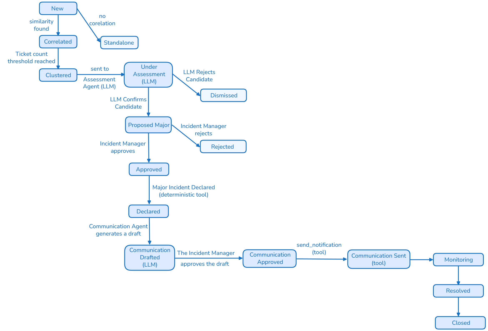

# Documentație Proiect
## Agent AI pentru Detecția Incidentelor Majore și Generarea Comunicării Automate
### Categorie: IT Service Management (ITSM) – Incident Management

**Denumire agent:** Major Incident Agent (MIA)
**Autor:** _[]_

---

## Cuprins

1. [Definirea problemei și scopul proiectului](#1-definirea-problemei-și-scopul-proiectului)
2. [Înțelegerea procesului (AS-IS)](#2-înțelegerea-procesului-as-is)
3. [Soluția propusă / Fluxul TO-BE](#3-soluția-propusă--fluxul-to-be)
4. [Arhitectura generală a sistemului](#4-arhitectura-generală-a-sistemului)
5. [Structura datelor și abordarea RAG](#5-structura-datelor-și-abordarea-rag)
6. [Reasoning / Decizie / Execuție](#6-reasoning--decizie--execuție)
7. [KPI-uri și Success Criteria](#7-kpi-uri-și-success-criteria)
8. [Observabilitate și audit](#8-observabilitate-și-audit)
9. [Stack tehnic și livrarea ca produs](#9-stack-tehnic-și-livrarea-ca-produs)
10. [Riscuri, limitări și dezvoltări viitoare](#10-riscuri-limitări-și-dezvoltări-viitoare)
11. [Anexe](#11-anexe)

---

## 1. Definirea problemei și scopul proiectului
### 1.1 Context business / IT

În organizațiile mari, un incident major — precum indisponibilitatea unei aplicații critice, o defecțiune a rețelei sau o cădere a serviciilor cloud — generează frecvent un val de tichete individuale, raportate într-un interval scurt de timp de utilizatori diferiți, dar având aceeași cauză reală.

Într-un proces ITSM tradițional, fiecare incident este înregistrat și analizat separat de către echipa de suport. Atunci când mai mulți utilizatori raportează aceeași problemă, tichetele similare pot fi tratate inițial ca incidente distincte. Identificarea faptului că acestea au o cauză comună și reprezintă, de fapt, **un singur incident major**, se bazează în mare parte pe analiza manuală și pe experiența operatorilor sau a Incident Managerului.

Corelarea incidentelor presupune compararea unor informații precum titlul și descrierea, serviciul sau aplicația afectată, utilizatorii, locația și momentul raportării. Atunci când numărul de tichete este mare, analiza manuală devine dificilă și poate întârzia identificarea unui incident major. 

După identificarea unui posibil incident major, comunicarea către utilizatorii afectați și management este adesea realizată manual. Acest lucru poate duce la întârzieri și la mesaje diferite ca exprimare, structură și detaliile date, în funcție de destinatari.

Această abordare poate conduce la:
- **identificarea întârziată a incidentelor majore, din cauza lipsei corelării automate între tichetele similare**;
- **creșterea efortului manual, necesar pentru analizarea unui număr mare de tichete**;
- **prioritizare și escaladare inconsistente, în funcție de experiența și disponibilitatea operatorilor**;
- **creșterea numărului de tichete duplicate, deoarece utilizatorii pot raporta aceeași problemă fără să știe că aceasta este deja investigată**;
- **întârzierea comunicării către utilizatori și management, precum și transmiterea unor mesaje diferite ca structură și conținut**;
- **creșterea MTTR (Mean Time to Repair), ca urmare a timpului suplimentar necesar pentru identificarea și gestionarea incidentului**;
- **scăderea încrederii utilizatorilor și a business-ului în serviciile IT, ca urmare a lipsei de vizibilitate și a comunicării întârziate**.

Prin urmare, problema nu este doar volumul mare de tichete, ci și dificultatea de a identifica rapid faptul că mai multe incidente aparent independente au aceeași cauză și fac parte dintr-un singur incident major.

### 1.2 Obiectivul proiectului

Obiectivul proiectului este dezvoltarea unui agent AI (**Major Incident Agent**) care:
1. **Detectează automat** posibile incidente majore prin analiza similarității semantice (embeddings + cosine similarity + clustering) între tichetele nou create într-un interval de timp definit.
2. **Evaluează** (prin LLM, cu output structurat/validat) dacă un cluster de tichete similare reprezintă cu adevărat un candidat de incident major, pe baza informațiilor istorice relevante (RAG).
3. **Generează automat** un draft de comunicare (separat pentru utilizatorii finali și pentru management), pe baza unor template-uri și a informațiilor relevante despre incident.
4. Trece comunicarea și declararea incidentului major printr-un **punct de aprobare umană** (human-in-the-loop) înainte de trimiterea rezultatului.
5. **Loghează și expune** întregul lanț de decizie (audit + observabilitate).

### 1.3 Scopul proiectului (In-Scope)

- Introducerea de tichete (mock data, format text – „problem report”) simulând un flux realist dintr-un ITSM (ex. ServiceNow/Jira-like).
- Calcul embeddings pe descrierea tichetelor + clustering pe similaritate cosinus, într-o fereastră de timp configurabilă (ex. ultimele 15-30 min / ultimele N tichete).
- Un modul LLM de **assessment** (confirmă / infirmă candidatul de incident major, motivează, estimează gravitatea) – output JSON validat Pydantic.
- Un modul RAG (ChromaDB) cu bază de cunoștințe: incidente majore istorice + post-mortem-uri + runbook-uri + template-uri de comunicare, folosit pentru a fundamenta atât decizia, cât și textul comunicării (cu citări).
- Generare comunicare (2 variante: user-facing, management-facing), output JSON validat.
- Guardrail de aprobare umană înainte de orice acțiune „vizibilă extern" (trimitere comunicare, declarare oficială major incident).
- Execuție deterministă a acțiunilor aprobate (tool-uri: trimitere notificare, update status tichete, link-uire tichete la incidentul părinte).
- Observabilitate end-to-end (Arize Phoenix) și audit trail.
- KPI de măsurare a impactului față de procesul manual.
- Livrare: API FastAPI + UI Streamlit + containerizare Docker.

### 1.4 În afara scopului (Out of Scope)

- Remedierea tehnică efectivă a incidentului (root cause fixing) – agentul **nu** execută acțiuni de remediere infrastructură (restart servicii, rollback deploy etc.), doar detectează, evaluează și comunică.
- Integrare live cu un ITSM real de producție (ServiceNow/Jira) – se lucrează cu date mock și, opțional, conectori simulați.
- Traducere în mai multe limbi a comunicărilor (se livrează în limba definită în configurare, implicit EN).
- Predicție proactivă de incidente înainte ca tichetele să apară (capacity/anomaly forecasting) – agentul e reactiv, bazat pe tichetele deja create.
- Fine-tuning propriu al unui model LLM (se folosește few-shot / prompt engineering pe model open-source via Ollama sau Groq free tier).

### 1.5 Asumpții (Assumptions)

- Tichetele conțin minim: id, timestamp, textul problemei (free text), serviciul/aplicația afectată (dacă e cunoscută), prioritate inițială, reporter.
- Volumul și distribuția temporală a tichetelor mock reflectă tipare realiste (perioade „calme" + „burst"-uri simulând incidente majore).
- Un incident „major" este definit organizațional printr-un set de criterii cuantificabile, nu doar prin percepția LLM-ului.
- Accesul la modelele LLM/embeddings (Ollama local sau Groq API free tier) este disponibil în mediul de dezvoltare/demo.

## 2. Înțelegerea procesului (AS-IS)
### 2.1 Procesul tradițional de Incident Management

Într-un proces ITSM tradițional, incidentele sunt raportate și gestionate inițial ca tichete individuale. Un utilizator poate raporta o problemă prin intermediul unui portal self-service, email, telefon sau al altui canal disponibil, iar sistemul ITSM creează un tichet asociat problemei raportate.

Procesul tradițional poate fi reprezentat astfel:

```text
Incident raportat
       ↓
Creare tichet
       ↓
Clasificare și prioritizare
       ↓
Alocare către echipa responsabilă
       ↓
Analiză și investigare manuală
       ↓
Căutare manuală a incidentelor similare
       ↓
Identificare posibil Major Incident
       ↓
Escaladare / Confirmare
       ↓
Declarare Major Incident
       ↓
Comunicare către utilizatori și management
       ↓
Rezolvare Ticket
       ↓
Închidere Ticket
```

Procesul este în principal bazat pe analiza individuală a tichetelor și pe intervenția persoanelor responsabile de Incident Management. Corelarea mai multor incidente care pot avea aceeași cauză este realizată în funcție de informațiile disponibile și de observațiile echipelor implicate.

### 2.2 Raportarea și înregistrarea incidentelor

Fiecare problemă raportată de un utilizator este înregistrată, de regulă, ca un tichet individual în sistemul ITSM.

În cazul în care mai mulți utilizatori întâmpină aceeași problemă, pot fi create mai multe tichete distincte. De exemplu, pentru o problemă asociată serviciului VPN pot apărea următoarele incidente:
- INC001 — „Cannot access corporate VPN”
- INC002 — „VPN connection failing”
- INC003 — „Remote employees cannot connect to VPN”
- INC004 — „VPN authentication unavailable”
- INC005 — „Unable to establish VPN connection”

Deși aceste tichete pot descrie aceeași problemă din perspective diferite, ele sunt inițial înregistrate și procesate separat.

### 2.3 Clasificarea, prioritizarea și alocarea

După înregistrare, fiecare tichet este analizat și clasificat conform procesului ITSM existent.
În această etapă sunt stabilite, în funcție de informațiile disponibile:
- categoria incidentului;
- serviciul afectat;
- impactul;
- urgența și prioritatea;
- echipa responsabilă de investigare și rezolvare.

Tichetele sunt apoi alocate către grupurile de suport sau echipele tehnice corespunzătoare.
Analiza este realizată în principal la nivelul fiecărui tichet. În consecință, faptul că mai multe incidente pot avea aceeași cauză nu este întotdeauna evident în această etapă.

### 2.4 Investigarea și identificarea incidentelor similare

Echipa responsabilă investighează fiecare incident și încearcă să determine cauza problemei.
Atunci când există suspiciunea că mai multe incidente sunt corelate, operatorii pot căuta manual alte tichete cu simptome similare. Această analiză poate lua în considerare informații precum:
- descrierea incidentului;
- serviciul afectat;
- momentul apariției;
- simptomele raportate;
- numărul de utilizatori afectați;
- informațiile disponibile în sistemul ITSM.

Identificarea unei relații între incidente depinde de informațiile disponibile și de experiența persoanelor care efectuează analiza.
În cazul unor formulări diferite ale aceleiași probleme, corelarea poate necesita o analiză suplimentară.

### 2.5 Identificarea și confirmarea unui posibil Incident Major

Un posibil Incident Major poate fi identificat atunci când operatorii observă un volum neobișnuit de incidente similare, un impact semnificativ asupra unui serviciu sau alte indicii care sugerează existența unei probleme comune.

Identificarea poate apărea, de exemplu:
- în urma analizei dashboard-urilor ITSM;
- după mai multe escaladări;
- prin comunicarea dintre echipe;
- ca urmare a creșterii numărului de incidente pentru același serviciu;
- în urma identificării unor simptome comune în mai multe tichete.

După identificarea unui posibil Major Incident, situația este analizată împreună cu echipele tehnice relevante pentru confirmarea impactului și a existenței unei posibile cauze comune.
În funcție de criteriile organizației, Incident Manager-ul sau persoana responsabilă decide dacă incidentul trebuie declarat Major Incident.

### 2.6 Comunicarea

Pe durata unui Major Incident, informațiile despre incident sunt comunicate către părțile interesate relevante.
Comunicarea poate include:
- serviciul afectat;
- problema identificată sau suspectată;
- impactul asupra utilizatorilor;
- statusul curent;
- acțiunile aflate în desfășurare;
- următorul update estimat, atunci când acesta este disponibil.

Mesajele pot fi adaptate în funcție de audiență. Utilizatorii finali necesită, de regulă, informații orientate către impact și disponibilitatea serviciului, în timp ce managementul necesită informații suplimentare privind amploarea incidentului, impactul și acțiunile de remediere.
În procesul actual, pregătirea și transmiterea comunicărilor presupun intervenție manuală.

### 2.7 Rezolvarea și închiderea

După identificarea și implementarea soluției, serviciul este readus în starea normală de funcționare.
Incidentele asociate sunt actualizate conform procedurilor ITSM, iar după îndeplinirea criteriilor de închidere acestea sunt închise.
Informațiile rezultate în urma incidentului pot fi ulterior utilizate pentru documentație, analiză post-incident și îmbunătățirea procesului.

### 2.8 Principalele blocaje și limitări ale procesului

Analiza procesului actual evidențiază mai multe puncte în care activitățile manuale pot produce întârzieri sau inconsistențe.

| # | Blocaj / limitare | Impact asupra procesului |
|---|---|---|
| 1 | Identificarea unui volum neobișnuit de incidente depinde de observația operatorilor | Un posibil Major Incident poate fi identificat cu întârziere |
| 2 | Tichetele sunt analizate inițial individual | Incidentele care au aceeași cauză pot rămâne fragmentate |
| 3 | Incidentele similare pot utiliza formulări diferite | Corelarea lor necesită analiză manuală |
| 4 | Confirmarea unui posibil Major Incident necesită coordonare între echipe | Poate crește timpul până la escaladare și declarare |
| 5 | Asocierea incidentelor cu un incident-părinte poate fi manuală | Crește efortul operațional și riscul de inconsistențe |
| 6 | Comunicările sunt pregătite și adaptate manual | Pot apărea întârzieri sau diferențe între comunicări |
| 7 | Informațiile istorice sunt accesate manual | Contextul relevant poate să nu fie identificat la momentul potrivit |
| 8 | Deciziile și acțiunile pot fi distribuite între mai multe sisteme și persoane | Trasabilitatea procesului poate fi dificil de reconstruit |

### 2.9 Ce poate fi îmbunătățit cu ajutorul AI

Din analiza AS-IS reies câteva puncte concrete unde un agent AI poate elimina munca manuală, fără să înlocuiască decizia umană pe zonele riscante:

| Etapă manuală (AS-IS) | Ce automatizează AI | Ce rămâne manual |
|---|---|---|
| Căutare manuală a tichetelor similare | Embeddings + clustering pe cosine similarity, rulat continuu | — |
| Interpretarea dacă un cluster e „suficient de mare/grav" | LLM Assessment Agent, fundamentat pe RAG (incidente istorice similare) | Confirmarea finală a candidatului |
| Scriere comunicare (user vs management) | LLM Communication Agent, pe bază de template-uri din RAG | Aprobarea și eventuala editare a textului |
| Declarare oficială Major Incident | Propunere structurată, cu motivare și severitate estimată | Decizia de declarare (aprobare/respingere) |
| Legarea tichetelor la incidentul părinte | Tool determinist, executat automat după aprobare | — |

## 3. Soluția propusă / Fluxul TO-BE

### 3.1 Descrierea soluției

Soluția propusă urmărește automatizarea etapelor de identificare și evaluare a incidentelor care pot indica existența unui Incident Major, păstrând controlul uman asupra deciziilor cu impact operațional.

În locul identificării exclusiv manuale a relațiilor dintre tichete, sistemul analizează continuu incidentele noi și identifică grupuri de incidente care prezintă caracteristici comune.

Fluxul TO-BE este:
```text
Tichet nou
    ↓
Analiză și corelare cu incidente recente
    ↓
Identificarea unui grup de incidente similare
    ↓
Evaluare posibil Incident Major
    ↓
Propunere Incident Major
    ↓
Validare și aprobare Incident Manager
    ↓
Declarare Incident Major
    ↓
Pregătire comunicare
    ↓
Aprobare comunicare
    ↓
Transmitere comunicare
    ↓
Monitorizare evoluție incident
    ↓
Rezolvare și comunicare de închidere
```

### 3.2 Fluxul TO-BE

La apariția unui tichet nou, sistemul verifică dacă acesta este asociat unor incidente recente cu caracteristici similare.

Dacă nu este identificată o corelare relevantă, tichetul continuă pe fluxul standard de Incident Management.

Dacă sunt identificate suficiente incidente similare, acestea sunt grupate într-un posibil cluster de incidente corelate. Clusterul este evaluat pentru a determina dacă există indicii suficiente pentru inițierea procesului de Incident Major.

În cazul identificării unui posibil Incident Major, Incident Manager-ul primește o propunere care include informațiile relevante pentru luarea deciziei.

Dacă propunerea este aprobată, incidentul este declarat Incident Major și sunt inițiate activitățile corespunzătoare, inclusiv comunicarea către utilizatori și management.

Pe durata incidentului, sistemul continuă să urmărească evoluția situației și poate propune actualizări ale statusului sau comunicări suplimentare.

După rezolvarea incidentului, poate fi propusă comunicarea de închidere, care este supusă aceluiași proces de validare înainte de transmitere.

### 3.3 Ce diferă concret față de AS-IS

| Dimensiune | AS-IS (manual) | TO-BE (agentic) |
|---|---|---|
| Corelare tichete | Manuală, de la caz la caz | Continuă, automată (embeddings + clustering) |
| Timp până la identificare candidat | Minute–ore, în funcție de observația operatorului | Secunde–minute, pe fereastră configurabilă |
| Fundamentare decizie | Experiență individuală | RAG pe istoric (incidente similare, runbook-uri), cu citări |
| Consistență comunicare | Variabilă, per persoană | Template + LLM, consistentă pe structură |
| Decizie finală | 100% umană | Umană, dar asistată de propunere structurată (human-in-the-loop) |
| Trasabilitate | Fragmentată, în mai multe sisteme | Centralizată (audit trail + observabilitate) |

## 4. Arhitectura generală a sistemului
### 4.1 Principii de arhitectură

Arhitectura pentru Major Incident Agent este construită pe câteva principii care se aplică la nivelul întregului sistem:

1. **Separare reasoning / execuție** – componentele care „gândesc" (LLM) nu ating niciodată direct un sistem extern; ele produc doar propuneri structurate (JSON validat Pydantic). Componentele care „acționează" sunt tool-uri deterministe, apelate doar după validare/aprobare.
2. **Human-in-the-loop pe punctele riscante** – orice acțiune vizibilă extern (comunicare trimisă, incident declarat oficial) trece printr-un gate de aprobare umană.
3. **Trasabilitate completă** – fiecare pas (input, prompt, output LLM, sursă RAG, decizie umană, acțiune executată) este logat și expus prin observabilitate.
4. **Componente înlocuibile** – detectarea (embeddings/clustering), reasoning-ul (LLM) și execuția (tool-uri) sunt module separate, ce pot fi înlocuite/actualizate independent (ex. schimbarea providerului LLM din Ollama în Groq nu afectează restul sistemului).

### 4.2 Roluri de agenți

| Agent / Componentă | Tip | Responsabilitate | Output |
|---|---|---|---|
| **Ticket Ingestion Service** | Determinist (tool) | Preia tichetele din sursa mock (Jira-like API) | Listă tichete (JSON) |
| **Detection Pipeline** | Determinist (embeddings + clustering) | Calculează embeddings pe descrierea tichetelor, aplică clustering pe cosine similarity într-o fereastră de timp | Clustere candidate de tichete similare |
| **Assessment Agent (LLM)** | Reasoning | Analizează un cluster candidat + context RAG, decide dacă e plauzibil un Major Incident, estimează severitate, motivează | `IncidentAssessment` (Pydantic) |
| **Communication Agent (LLM)** | Reasoning | Generează draft de comunicare (user-facing + management-facing), pe baza template-urilor și a contextului RAG | `CommunicationDraft` (Pydantic) |
| **Approval Gateway** | Human-in-the-loop | Incident Manager validează/respinge propunerea de Major Incident și draftul de comunicare | Decizie (approve/reject/edit) |
| **Execution Layer** | Determinist (tool-uri) | Execută acțiunile aprobate: trimite notificare, actualizează status tichete, leagă tichete la incidentul părinte | Confirmare execuție |
| **Observability Layer** | Infrastructură | Trace-uiește fiecare pas al fluxului (Arize Phoenix) și menține audit trail | Trace-uri + audit log |
| **Orchestrator** | Coordonator | Coordonează handoff-urile între componente, menține state-ul fluxului | State transitions |

### 4.3 Tool-uri (function-calling / deterministice)

| Tool | Rol | Apelat de |
|---|---|---|
| `fetch_tickets(since, limit)` | Interoghează mock API-ul Jira-like, returnează tichete noi | Orchestrator / Ingestion Service |
| `compute_embeddings(texts)` | Generează embeddings pentru descrierile tichetelor | Detection Pipeline |
| `cluster_tickets(embeddings, threshold)` | Clustering pe cosine similarity (ex. HDBSCAN/DBSCAN) | Detection Pipeline |
| `query_knowledge_base(query, collection)` | Interoghează ChromaDB (RAG) pentru incidente istorice / runbook-uri / template-uri | Assessment Agent, Communication Agent |
| `generate_assessment(cluster, rag_context)` | Apel LLM cu output structurat (Pydantic) | Assessment Agent |
| `generate_communication(incident, rag_context, audience)` | Apel LLM cu output structurat (Pydantic) | Communication Agent |
| `send_notification(channel, audience, content)` | Trimite comunicarea (simulat: email/Slack mock) | Execution Layer, doar după aprobare |
| `update_ticket_status(ticket_ids, status)` | Actualizează statusul tichetelor asociate | Execution Layer, doar după aprobare |
| `link_tickets_to_parent(ticket_ids, parent_incident_id)` | Leagă tichetele individuale de incidentul-părinte | Execution Layer, doar după aprobare |
| `log_audit_event(actor, action, payload)` | Scrie o intrare de audit (cine, ce, când, pe ce bază) | Toate componentele |

### 4.4 Handoff-uri între agenți (state machine)

Fiecare tichet și fiecare cluster/incident au un state propriu, iar trecerea între stări reprezintă un handoff explicit între componente:



### 4.5 Diagramă de componente (arhitectură high-level)

### 4.6 Diagramă de secvență (flux end-to-end)


## 5. Structura datelor și abordarea RAG
## 6. Reasoning / Decizie / Execuție
## 7. KPI-uri și Success Criteria
## 8. Observabilitate și audit
## 9. Stack tehnic și livrarea ca produs
## 10. Riscuri, limitări și dezvoltări viitoare
## 11. Anexe

---

Licență
Acest proiect este licențiat sub licența MIT. Bibliotecile și resursele terțe rămân supuse propriilor licențe.

---
